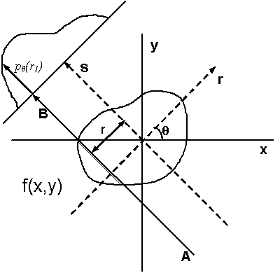

# Example 02

## Description

### Physics Motivation

#### Tomographic reconstruction

Tomography is a type of 3D imaging that uses some type of penetrative wave, in our case an X-ray beam. Tomographic reconstruction refers to the process of recovering 3D spatial information on an object from a set of projected images acquired under different angles after transmission of the beam through the sample.

|  |
|:--:|
| Illustration of tomographic reconstruction (https://en.wikipedia.org/wiki/Tomographic_reconstruction). The projected image on the detector results from transmission of the beam through the sample at a given angle at varying locations. The intensity at the detector depends on the amount of scattering and absorption in the sample or on, what is often called, its linear attenuation coefficient. Spatial variations in for example density can lead to spatial variations of the local attenuation coefficient. The intensity on the detector is basically a measure of its line integral along a path $AB$ at a projected sample position $r$. We can then obtain full 3D reconstruction of the spatial variation from a set of 2D images at varying angles $\theta$ by a mathematical inversion technique called the inverse Radon transform  (https://en.wikipedia.org/wiki/Radon_transform). |

#### The input data

A standard tomographic experiment at CHESS (and other similar institutions) consist of a set of X-ray transmission measurements captured on a 2D area detector. It typically involves two (sets of) measurements without a sample in the beam, one with the beam stop in place (the dark image), and one with the beam stop open (the bright image). Followed by a measurement of a stack of images (a tomographic image series) at varying rotation angle (over 180 or a full 360 degrees of rotation) with the sample in the beam secured to a rotating sample holder. Note that if the sample is larger than the beam cross section, this may require multiple image stacks at various sample positions in the plane perpendicular to the X-ray beam.

#### Processing the data

A standard tomographic reconstruction in CHAP consists of three steps:

1. Reducing the raw data, i.e., correcting the raw detector images for background
and non-uniformities in the beam intensity profile using dark and bright fields
collected separately from the (multiple) tomography image series.

1. Finding the calibrated rotation axis. Accurate reconstruction relies on
accurately knowing the center of rotation at each data plane perpendicular to
the rotation axis (the sinogram). This rotation axis is calibrated by selecting
two data planes, one near the top and one near the bottom of the sample or
beam, and visually or automatically picking the optimal center location.

1. Reconstructing the reduced data for the calibrated rotation axis.
For samples taller than the height of the beam, this last step can consist of
two parts:
    - reconstruction of each individual stack of images, and
    - combining the individual stacks into one 3D reconstructed data set.

Note that combining stacks with a horizontal displacement for samples wider than the width of the beam are not yet implemented.

## Instructions

1. Make a copy of this repository to your workspace on the CLASSE filesystem so you can explore and edit these files on your own. Run:
   ```
   cp -r /nfs/chess/user/x-cite/CHAP-Training-Examples-Materials /nfs/chess/user/$USER/
   ```
1. Activate the conda environment. This ensures you will run the correct version of `python`, `CHAP`, and have all the extra third-party python modules available that are necessary for later steps in this example. Open a terminal and run:
    1. ```
       source /nfs/chess/user/x-cite/miniconda3/bin/activate
       ```
    1. ```
       conda activate CHAP_example_02
       ```

1. Process the input data using `CHAP`. In the same terminal used in step 1 and 2:
    1. Navigate to your `CHAP-Training-Examples-Materials/example_02` directory
    1. Inspect the contents of `pipeline.yaml` by running:
       ```
       cat pipeline.yaml
       ```
       This file configures the CHAP pipeline you are about to run. It is meant to be human-readable, but don't expect to understand every detail. For now, just try to answer a few questions for yourself:
       - How do the variables in the `config` section set the absolute locations of in/output files?
       - Which files are data being read from / written to, and what kind of data are being read / written there?
    1. Run the pipeline (this step should take ~1min to complete; watch the logging output in the terminal for indication of progress):
       ```
       CHAP pipeline.yaml
       ```
    1. Check that the expected output (`output/hollow_pyramid.nxs`) is present:
       ```
       ls output
       ```

1. Visualize the output data generated by this example with `NeXpy` (via a Jupyter notebook)
    1. Add the conda environment as a jupyter kernel. This makes the active python environment in your terminal avilable for _your_ use on the CLASSE JupyterHub -- you will be able to select this environment when running any notebook, meaning you will have access to the correct version of python and all the third-party modules you'll need for the notebook in this example. In the same terminal used in steps 1 to 3, run:
        ```bash
        python -m ipykernel install --user --name=chap_example_02 --display-name "CHAP_example_02"
        ```
        Make sure you see the following message in the terminal after running this command:
       ```
       Installed kernelspec chap_example_02 in /home/{user}/.local/share/jupyter/kernels/chap_example_02
       ```
       If other output is present before this message, it can be ignored.
    1. (optional) Unless you would like to explore the `NeXus` output file in `NeXpy` or any of the output figures directly from the terminal (see the optional exercises below), we're now done using the terminal with this example, so deactivate the environment by running `conda deactivate; conda deactivate` and closing the terminal.
    1. In JupyterHub, navigate to the directory with the jupyter notebook:
        1. Double-click on CLASSE_shortcuts folder
        1. Double-click on chess_[username] folder: This is a softlink to `/nfs/chess/user/[username]`
        1. Double-click on CHAP-Training-Examples-Materials -> example_02
    1. Open the notebook by double-clicking on visualize.ipynb
    1. Select Kernel: choose CHAP_example_02
    1. Run the cells in order (click the right-triangle button or type Shift-Enter). Close the notebook tab when done.

## Optional excersizes

1. Create the simulated tomography data as used in the main example above. In the same terminal used in step 1 and 2 of the main example instructions above:
    1. Navigate to your `CHAP-Training-Examples-Materials/example_02` work directory.
    1. Inspect the contents of `pipeline_create_simdata.yaml` by running:
       ```
       cat pipeline_create_simdata.yaml
       ```
       This file configures the CHAP pipeline you are about to run to simulate a tomography experiment. 
       - Check again, how the variables in the `config` section set the locations of in/output files.
    1. Run the simulation:
       ```
       CHAP pipeline_create_simdata.yaml
       ```
    1. After completion, you should have a data directory in your work directory with the SPEC data for a sample named "hollow_pyramid" of a simulated tomography experiment on a truncated hollow square pyramid on the CHESS id1a3 beamline.
    1. Rerun step 3 from the main example above after editing the `pipeline.yaml` to point the `inputdir` to the new simulated data base location `./hollow_pyramid`.

    1. The job's output will overwrite the existing data in the `output` directory. Check the date of the expected output file:
       ```
       ls -l output
       ```
    1. Additional optional output figures (`.png`) may have been saved to an output directory specified in the pipeline file in the `outputdir` field under the `tomo.TomoDataProcessor` pipeline item. They  can be viewed directly by any PNG image viewer.

1. View the tomographic reconstruction for the truncated pyramid in `NeXpy`, a GUI interface to view `NeXus` files. This requires you to have X11-forwarding enabled in your terminal session, ask an instructor or Google `setup X11-forwarding` if you don't know what this means. In the same terminal used in step 1 and 2 of the main example instructions above or in the optional exercise terminal:
    1. Open the NeXpy GUI by entering in your terminal:
        ```
        nexpy &
        ```
    1. Double click on the base level `NXroot` field in the leftmost "NeXus Data" panel to view the reconstruction. Note that the `NXroot` name is always the basename of the output file.
    1. Or navigate the file tree in the "NeXus Data" panel to inspect any other
output or metadata field. Note that the latest data set in any tomography
reconstruction workflow is always available under the "data" `NXdata` field
among the default `NXentry`'s fields (it is this data set that is opened in the
viewer panel when double clicking the `NXroot` field). The default `NXentry`
name is always the "title" field in the workflow's map configuration, in this
case "hollow_pyramid".
    1. When finished, quit NeXpy
    1. (optional) Deactivate the environment by running `conda deactivate; conda deactivate` and closing the terminal, unless you want to explore some more or look at the data from a real axample.

## Real experiment example

A full tomographic reconstruction from an actual CHESS experiment can easliy take half an hour or longer, requires a fair amount of computational resources and generates tens of GBs of data. It is therefore not suitable for the purpose of this tutorial. However, there is a fully reconstructed dataset available to view with `NeXpy` to illustate an example of an actual reconstructed sample measured here at CHESS on a tube filled with tiny ruby balls:

1. Start `NeXpy` in a terminal as described in the step 1 of the second optional excersize above. This requires you again to have X11-forwarding enabled in your terminal.
    1. After the GUI pops up, click File-> Open and enter the following path in the File name box at the bottom: `/nfs/chess/user/x-cite/data/example_02/ruby_test`
    1. Hit enter
    1. Select `reconstructed.nxs` and hit enter again.
    1. Double click on the base level `NXroot` field in the leftmost "NeXus Data" panel to view the reconstruction. Note that the `NXroot` name is always the basename of the output file.
    1. Select the "z" tab underneath the figure in the display panel and enter 1.5 in the box under the tab. Note that interactions in the GUI and refreshing of the figure will be somewhat slow due to the size of the dataset.
    1. Select the "signal" tab underneath the figure in the display area and enter a range from -0.01 to 0.01 in the available boxes under the tab.
    1. Under the same panel change the color scheme from the default of "viridis" to "grey" using the pull down menu.
    1. Change to a log schale for the color bar by selecting the "Log" box.
    1. Change the slicing direction in the viewer by selecting the "y" tab and changing it from the default of "y" to "z" in the pull down menu.
    1. These are just a few examples of how to view data within `NeXpy`, feel free to play around some more with other options.
1. As an alternative to viewing the data in `NeXpy`, you can also open a Jupyter notebook in `JupyterHub` as explained in step 4 under the instructions for the main example above.
    1. After opening the Jupyter notebook, edit the second cell (`#load data`) and set `nxs_filename = /nfs/chess/user/x-cite/data/example_02/ruby_test/reconstructed.nxs`.
    1. Double click on the base level `NXroot` field in the leftmost "NeXus Data" panel to view the reconstruction. Note that any cells using hardwired paths to the pyramid example are failing, but those using default paths still work as expected (advanced option: edit the hardwired paths to the correct location). Note also that the default range for plotting the cross-sections in the last cells is not very useful, add `vmin=-0.01, vmax=0.01` inside the braces of the `plot()` commands to change the range.


